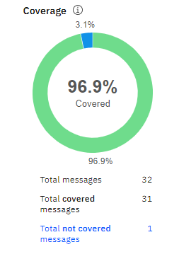

### Trabalho final disciplina Chatbots

Para realização do chatbot, utilizou-se a plataforma Watson da IBM. O bot serve como assistente para uma companhia de seguros fictícia, a Seguradora X.
O fluxo de diálogo do bot é apresentado no arquivo [PDF](/Fluxograma_Chatbot.pdf).

O código [JSON](/skill-Chatbot-Seguradora.json) do Watson contém todas características especificadas no bot.

O bot roda localmente em uma página [HTML](/bot.html), que acessa a plataforma online do Watson. Para executá-lo, basta fazer o download e abrir com algum navegador de preferência (testado no Chrome).

Para integração com webservice, utilizou-se um mock online e gratuito. A ideia é que, caso a aplicação fosse realizada para uma empresa real, esse webservice verificaria os dados do usuário, como número da apólice, nome e até mesmo realizaria agendamento. Contudo, para esse estudo utilizou-se uma abordagem mais simplificada. O webhook pode ser acessado através desse [Link](https://webhook.site/#!/85f0e81c-0aaf-49d3-9798-008572c87063/dc91560b-83ae-4e25-8d54-fa6b0f13b2df/1).

Para a geração das métricas e estatísticas, utilizou-se a ferramenta Analytics do próprio Watson. Como o plano utilizado é o Lite, as conversas são zeradas após 7 dias. Para uma aplicação real, o uso de plataformas pagas são mais indicadas, já que as ferramentas de análise de desempenho são fundamentais para o bom funcionamento e melhorias dos bots.

A média de mensagens por conversação ao longo do tempo é apresentada como métrica no gráfico a seguir:

Esse gráfico permite avaliar o quantas interações são necessárias para que cada usuário tenha sua solicitação atendida. A linha do tempo permite avaliar como estão o progresso das mensagens ao longo do tempo. Se a média de mensagens forem aumentando ao longo do tempo, pode indicar que alguma alteração na versão de produção do bot não foi bem sucedida ou algum efeito externo aumentou o nível de estresse do bot (por exemplo, um efeito natural que destelha muitas casas de uma cidade e tal configuração não esteve bem mapeada no bot.)

O gráfico abaixo apresenta a cobertura das solicitações, ou seja, o quanto o bot consegue entender das intenções dos usuários.

Nesse caso, o volume de conversas foi relativamente baixo. Contudo, com o uso do bot em uma aplicação profissional espera-se que essa métrica apresente a qualidade do bot e o quanto os usuários estão conseguindo o utilizar para realizar suas solicitações. O progresso ao longo do tempo permite rastrear possíveis mudanças em interfaces ou fluxos do bot.

O próximo gráfico apresenta uma visão geral das coberturas, sem o progresso ao longo do tempo.

Aqui é possível visualizar a cobertura geral do bot, numero de mensagens entendidas corretamente e número de mensagens não entendidas. O time de desenvolvimento pode atribuir uma nota mínima de qualidade, por exemplo 90%, como referência para aceitar ou rejeitar o bot. Abaixo da nota referência, são necessárias alterações no bot com novo fluxo, uso de botões, criação de mais exemplos para as intenções, entre outros.